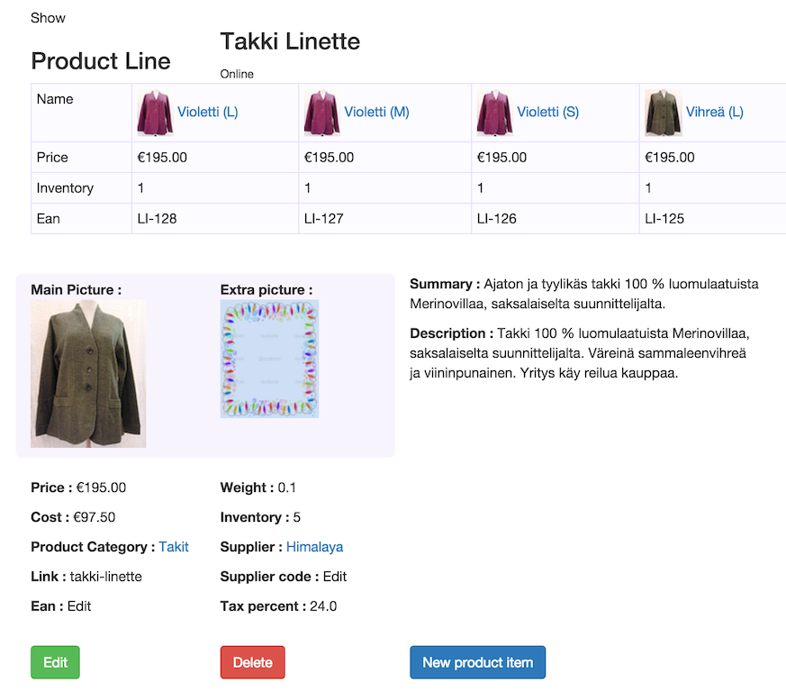

## Product Lines

In a shop, one often has similar products. Often almost identical apart from one certain property or attributes. 
The most common examples is probably color, so one would have a say, Galaxy Tab, in white or black for example.
In clothing this is especially common, and especially there there is often two attributes, namely color and size, that
vary. These products usually have the same price, though not always.

When talking about such products, it is quite common to call both the abstract, ie the Galaxy tab, and the concrete, 
a white Galaxy Tab, product. This works in everyday as there is two people both understanding the issue, 
but in a system we need to make the destinction and so we shall give them different names.

So when we refer to a **Product** we mean such a product as described in the previous chapter, ie a "normal" or 
"singluar" product.

The **abstact** product we shall call a **product line**, the Galaxy Tab in the example. 
It is the name of a group of products that are very similar, though how similar is up to you.

A **product item** is then a concrete instance of the product line, ie a white Galaxy Tab. It is in all respects like
a "normal" product, also in the code.

### Lifecycle 

Products are created and edited as per the previous chapter. Product lines and items are created differently:

A Product Line is created by adding a Product Item to a product. This may only be done if the product has no inventory as 
otherwise the abstract entity (product line) would carry that inventory forever.

In other words, a product item can only ever be aded to a product, it's line.

This also means that a product line retains all the products attributes, with these exception:

-  any ean found on a product line is nulled
- inventory show by the product line is the **sum** of the whole line, ie all product items belonging.

When a product item is added to a product line, many of the lines attributes are **copied** to the item. Specifically
weight, price, cost, tax , category , supplier and supplier code are all copied.

After the initial copy (which may be considered the product lines function) the data may be changed independently
of other items. Also, attributes changed in the ilne after some items have been created do not propagate to existing
items. The new data is only copied to new items. While this may seem cumbersome at fisrt, it allows a great deal of 
flexibility when working with product lines.

The picture shows how a product line is displayed. Notice the "product Line" in the top left, where previously was just
"Product". When editing or viewing a product item "Product Item" is displayed, so you can always see immediately what
type is viewed or edited.

Editing a Line or Item is basically the same as for products.

### Usage

The table below shows a summary of the destinctions between the three product versions.

|            |   | Product | Product Line | Product Item |
|----------
| sellable   |   | yes       | **no**       | yes
| ean/sku    |   | yes       | **no**       | yes
| own page   |   | yes       | yes          | **no**
| inventory  |   | yes       | no           | yes

As a prodcut line is an abstract idea, it can not be sold or have an ean. Similarly it can not have inventory and
the inventory it shows is the sum of all it's product items.

In the backend list view we see the amount of Product Items a Product Line in place where Products show their ean.

In the online shop, product items do not have their own page, and thus also no link. They are show as an option on 
the product line page. Also an items name is the concatination of the lines name and it's own. On the Lines shop page, 
Product Item summaries are used to further describe items and their differences.

[**<- Prev** Products](05_products.html)    [**Next ->** Suppliers](07_suppliers.html)